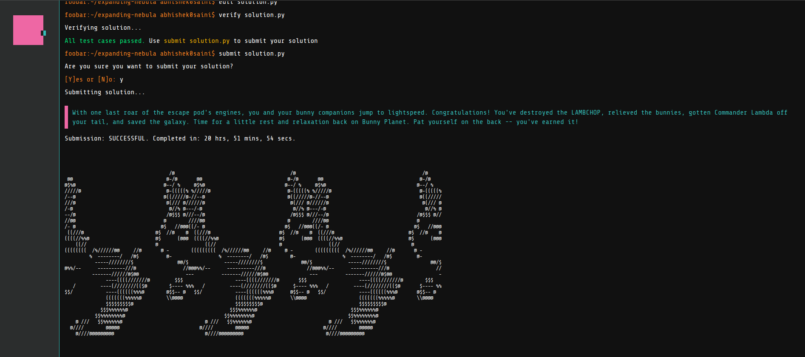

# My solutions to Google Foobar

What is [Google Foobar](https://www.joepatten.com/blog/google_foobar)?

Here are my solutions to the nine challenges that I got on Google Foobar. Some of the questions look scary on the first viewing but they are doable if you have some time to reflect on them. Some questions are also a bit math heavy and I didn't know the exact solutions to them. But if you can frame the problems correctly, you can easily find some literature on them.

Here are the problems that I got at each stage:

[Level 1 - The Cake is not a Lie](level_1_the_cake_is_not_a_lie)  
[Level 2 - Ion Flux Relabelling](level_2_ion_flux_relabelling)  
[Level 2 - Bunny Prisoner Locating](level_2_bunny_prisoner_locating)  
[Level 3 - Queue to Do](level_3_queue_to_do)  
[Level 3 - Doomsday Fuel](level_3_doomsday_fuel)  
[Level 3 - Find the Access Codes](level_3_find_the_access_codes)  
[Level 4 - Distract the Guards](level_4_distract_the_guards)  
[Level 4 - Running with Bunnies](level_4_running_with_bunnies)  
[Level 5 - Expanding Nebula](level_5_expanding_nebula)  
